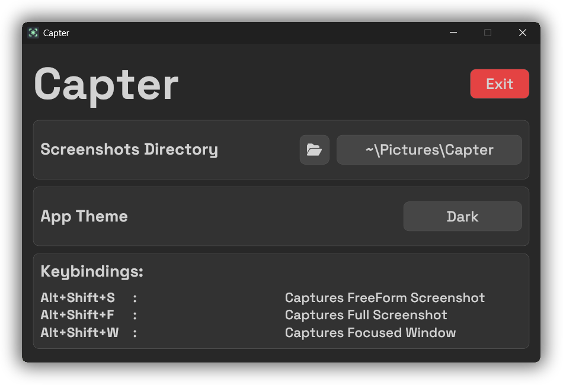
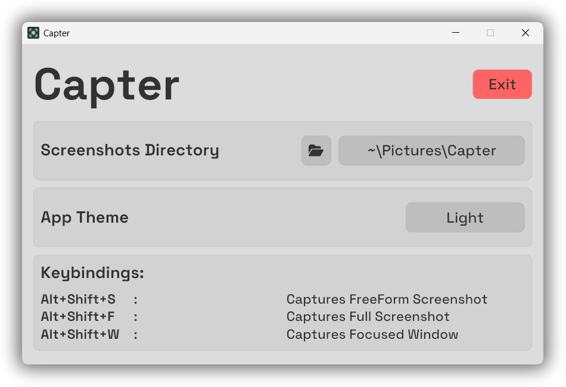

<p align="center">
    <picture>
      <source media="(prefers-color-scheme: dark)" srcset="https://raw.githubusercontent.com/decipher3114/Capter/master/assets/images/banner_dark.png">
      <source media="(prefers-color-scheme: light)" srcset="https://raw.githubusercontent.com/decipher3114/Capter/master/assets/images/banner_light.png">
      
    </picture>
</p>

A simple cross-platform screenshot tool made in Rust

## ✨ Features
- Captures FreeForm, FullScreen and Window
- Keybindings support
- Better usablity
    > FullScreen and Window Screenshots are immediate.
- Beautiful minimalistic UI

> Shortcomings
> - No Multi-monitor Support
> - No Screen Recording support

## 📥 Installation
- ### Cargo
    Install Rust and Run the following command
    ```
    cargo install --git https://github.com/decipher3114/Capter
    ```
- ### Prebuilts
    Download from [Releases](https://github.com/decipher3114/Capter/releases/latest)

- Fulfill these [Requirements](#requirements).
- Run `Capter`(Case sensitive) from terminal.

> You can add capter as symlink to startup directory depending on your OS

## 📋 Requirements
- **Linux**  
    - Install the following packages: `libxcb`, `libxrandr`, `dbus`.
        > Package name can be different depending on the distro
    - Add `$USER` to these groups: `input`, `evdev`(if present)

- **Mac OS**  
    - Grant Access to Accesiblity API: Add `Capter.exe` to **System Preferences > Security & Privacy > Privacy > Accessibility**

## 🖥️ Images

 |  |
--- | --- |
Dark Mode | Light Mode |

### 🙌 Thanks to
- [iced](https://github.com/iced-rs) community for their help
- [XelXen](https://github.com/xelxen) for UI
- Other crate maintainers